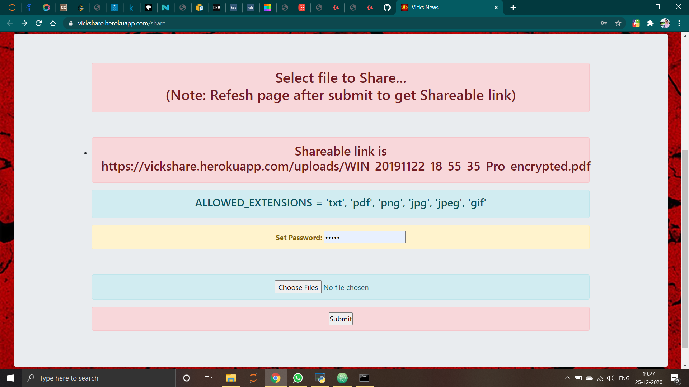

# [Share Files](https://github.com/imvickykumar999/vickshare/blob/11659f06973cfa0fbbf9a4da8afe27aa3e241e61/app.py#L93)

## Run `heroku logs -t -a vickshare` in CMD to check errors in [deployed site](https://vickshare.herokuapp.com/share).

