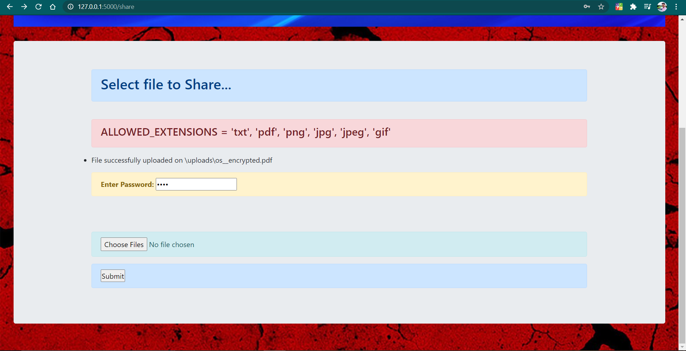

# [News Website](https://github.com/imvickykumar999/Flask-Image-Upload/blob/main/templates/upload.html)

## Run `heroku logs -t -a vickshare` in CMD to check errors in [deployed site](https://vicksnews.herokuapp.com/news).

